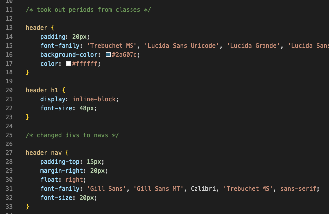
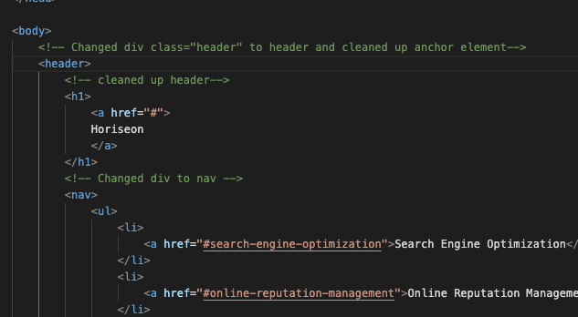
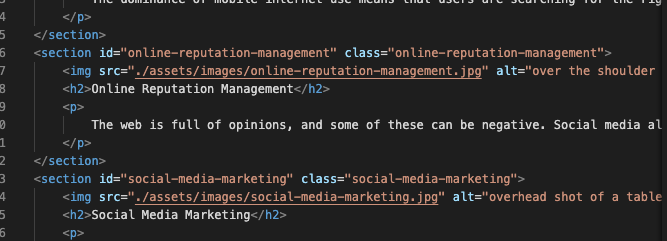

# Horiseon-Challenge

## A Marketing agency gave me their code to fix links, make it more accessible by changing the image alt attributes, and to streamline the semantic structure.

## CSS was updated to semantic structure changes in HTML

## Links were fixed in the nav section

## Built With
* HTML
* CSS

## Website
https://deepvelvet.github.io/Horiseon-Challenge/